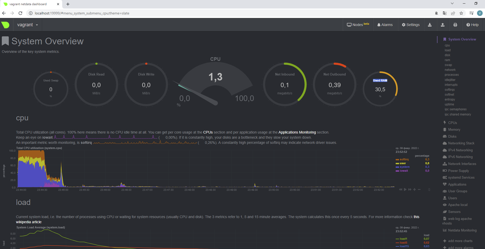

#_Домашнее задание занятию "3.3. Операционные системы, лекция 2"_ #
##Выполнил  - Каплин Владимир ##


1. На лекции мы познакомились с node_exporter. В демонстрации его исполняемый файл запускался в background. 
Этого достаточно для демо, но не для настоящей production-системы, где процессы должны находиться под внешним 
управлением. Используя знания из лекции по systemd, создайте самостоятельно простой unit-файл для node_exporter:

- поместите его в автозагрузку,
- предусмотрите возможность добавления опций к запускаемому процессу через внешний файл (посмотрите, например, на systemctl cat cron),
- удостоверьтесь, что с помощью systemctl процесс корректно стартует, завершается, а после перезагрузки автоматически поднимается.

Решение:

1.1. Установим node_exporter
```
vagrant@vagrant:~$ wget https://github.com/prometheus/node_exporter/releases/download/v1.3.1/node_exporter-1.3.1.linux-amd64.tar.gz

vagrant@vagrant:~$ tar xvfz node_exporter-1.3.1.linux-amd64.tar.gz
node_exporter-1.3.1.linux-amd64/
node_exporter-1.3.1.linux-amd64/LICENSE
node_exporter-1.3.1.linux-amd64/NOTICE
node_exporter-1.3.1.linux-amd64/node_exporter
```

1.2. Проверим, что он работает
```
vagrant@vagrant:~/node_exporter-1.3.1.linux-amd64$ ./node_exporter
ts=2022-02-08T19:53:06.162Z caller=node_exporter.go:182 level=info msg="Starting node_exporter" version="(version=1.3.1, branch=HEAD, revision=a2321e7b940ddcff26873612bccdf7cd4c42b6b6)"
ts=2022-02-08T19:53:06.162Z caller=node_exporter.go:183 level=info msg="Build context" build_context="(go=go1.17.3, user=root@243aafa5525c, date=20211205-11:09:49)"
ts=2022-02-08T19:53:06.165Z caller=filesystem_common.go:111 level=info collector=filesystem msg="Parsed flag --collector.filesystem.mount-points-exclude" flag=^/(dev|proc|run/credentials/.+|sys|var/lib/docker/.+)($|/)

vagrant@vagrant:~$ curl http://localhost:9100/metrics | grep "node_"
  % Total    % Received % Xferd  Average Speed   Time    Time     Time  Current
                                 Dload  Upload   Total   Spent    Left  Speed
# HELP node_arp_entries ARP entries by device
# TYPE node_arp_entries gauge
node_arp_entries{device="eth0"} 2
# HELP node_boot_time_seconds Node boot time, in unixtime.
# TYPE node_boot_time_seconds gauge
node_boot_time_seconds 1.644347531e+09
# HELP node_context_switches_total Total number of context switches.
# TYPE node_context_switches_total counter
node_context_switches_total 750278
# HELP node_cooling_device_cur_state Current throttle state of the cooling device
# TYPE node_cooling_device_cur_state gauge
```
1.3. Напишем простой unit скрипт:
```
vagrant@vagrant:~$ cd /lib/systemd/system/
vagrant@vagrant:/lib/systemd/system$ sudo touch node-exporter.service
vagrant@vagrant:/lib/systemd/system$ sudo vi node-exporter.service

[Unit]
Description=Node Exporter

[Service]
ExecStart=/home/vagrant/node_exporter-1.3.1.linux-amd64/node_exporter

[Install]
WantedBy=multi-user.target
```
1.4. Перегрузим все службы и инициализируем новоую службу

```
vagrant@vagrant:/etc/default$ sudo systemctl daemon-reload
vagrant@vagrant:/lib/systemd/system$ sudo systemctl enable node-exporter.service
Created symlink /etc/systemd/system/multi-user.target.wants/node-exporter.service → /lib/systemd/system/node-exporter.service.

```
1.5. Стартуем службу node-exporter и убедимся, что она работает,

```
agrant@vagrant:/lib/systemd/system$ sudo systemctl start node-exporter.service
vagrant@vagrant:/lib/systemd/system$ systemctl status node-exporter.service
● node-exporter.service - Node Exporter
     Loaded: loaded (/lib/systemd/system/node-exporter.service; enabled; vendor preset: enabled)
     Active: active (running) since Tue 2022-02-08 21:38:18 UTC; 22s ago
   Main PID: 2938 (node_exporter)
      Tasks: 5 (limit: 2278)
     Memory: 2.7M
     CGroup: /system.slice/node-exporter.service
             └─2938 /home/vagrant/node_exporter-1.3.1.linux-amd64/node_exporter

Feb 08 21:38:18 vagrant node_exporter[2938]: ts=2022-02-08T21:38:18.932Z caller=node_exporter.go:115 level=info collector=thermal_zone
Feb 08 21:38:18 vagrant node_exporter[2938]: ts=2022-02-08T21:38:18.932Z caller=node_exporter.go:115 level=info collector=time
Feb 08 21:38:18 vagrant node_exporter[2938]: ts=2022-02-08T21:38:18.932Z caller=node_exporter.go:115 level=info collector=timex
Feb 08 21:38:18 vagrant node_exporter[2938]: ts=2022-02-08T21:38:18.932Z caller=node_exporter.go:115 level=info collector=udp_queues
Feb 08 21:38:18 vagrant node_exporter[2938]: ts=2022-02-08T21:38:18.932Z caller=node_exporter.go:115 level=info collector=uname
Feb 08 21:38:18 vagrant node_exporter[2938]: ts=2022-02-08T21:38:18.932Z caller=node_exporter.go:115 level=info collector=vmstat
Feb 08 21:38:18 vagrant node_exporter[2938]: ts=2022-02-08T21:38:18.932Z caller=node_exporter.go:115 level=info collector=xfs
Feb 08 21:38:18 vagrant node_exporter[2938]: ts=2022-02-08T21:38:18.932Z caller=node_exporter.go:115 level=info collector=zfs
Feb 08 21:38:18 vagrant node_exporter[2938]: ts=2022-02-08T21:38:18.934Z caller=node_exporter.go:199 level=info msg="Listening on" address=:9100
Feb 08 21:38:18 vagrant node_exporter[2938]: ts=2022-02-08T21:38:18.934Z caller=tls_config.go:195 level=info msg="TLS is disabled." http2=false
```

1.5. Добавим файл с опциями как в cron.


```
[Unit]
Description=Node Exporter

[Service]
EnvironmentFile=/etc/default/node_exporter
ExecStart=/home/vagrant/node_exporter-1.3.1.linux-amd64/node_exporter $ADD_OPT

[Install]
WantedBy=multi-user.target

```

1.6. Создадим файл с опциями.
```
vagrant@vagrant:/etc/default$ sudo touch node_exporter  
vagrant@vagrant:/etc/default$ ls -al
total 116
drwxr-xr-x   3 root root 4096 Feb  8 21:48 .
drwxr-xr-x 109 root root 4096 Feb  8 19:31 ..

-rw-r--r--   1 root root  152 Aug 19  2019 networkd-dispatcher
-rw-r--r--   1 root root    0 Feb  8 21:48 node_exporter
-rw-r--r--   1 root root 1756 Apr 14  2020 nss

```
Добавим опцию ADD_OPT=--help  вывод помощи, т.е. служба должна отработать и остановиться.

```
vagrant@vagrant:/etc/default$ cat node_exporter
ADD_OPT=--help
```
1.7. Запустим службу с новыми параметрами, служба действительно отработала флаг --help и остановилась
```
vagrant@vagrant:/etc/default$ sudo systemctl stop node-exporter
vagrant@vagrant:/etc/default$ sudo systemctl daemon-reload
vagrant@vagrant:/etc/default$ sudo systemctl enable node-exporter.service
Removed /etc/systemd/system/multi-user.target.wants/node-exporter.service.
Created symlink /etc/systemd/system/multi-user.target.wants/node-exporter.service → /etc/systemd/system/node-exporter.service.
vagrant@vagrant:/etc/default$ sudo systemctl start node-exporter.service
vagrant@vagrant:/etc/default$ systemctl status node-exporter.service
● node-exporter.service - Node Exporter
     Loaded: loaded (/etc/systemd/system/node-exporter.service; enabled; vendor preset: enabled)
     Active: inactive (dead) since Tue 2022-03-01 22:39:42 UTC; 6s ago
    Process: 42882 ExecStart=/home/vagrant/node_exporter-1.3.1.linux-amd64/node_exporter $ADD_OPT (code=exited, status=0/SUCCESS)
   Main PID: 42882 (code=exited, status=0/SUCCESS)

Mar 01 22:39:42 vagrant node_exporter[42882]:                                  0 to disable.
Mar 01 22:39:42 vagrant node_exporter[42882]:       --collector.disable-defaults
Mar 01 22:39:42 vagrant node_exporter[42882]:                                  Set all collectors to disabled by default.
Mar 01 22:39:42 vagrant node_exporter[42882]:       --web.config=""            [EXPERIMENTAL] Path to config yaml file that
Mar 01 22:39:42 vagrant node_exporter[42882]:                                  can enable TLS or authentication.
Mar 01 22:39:42 vagrant node_exporter[42882]:       --log.level=info           Only log messages with the given severity or
Mar 01 22:39:42 vagrant node_exporter[42882]:                                  above. One of: [debug, info, warn, error]
Mar 01 22:39:42 vagrant node_exporter[42882]:       --log.format=logfmt        Output format of log messages. One of: [logfmt,
Mar 01 22:39:42 vagrant node_exporter[42882]:                                  json]
Mar 01 22:39:42 vagrant node_exporter[42882]:       --version                  Show application version.
```

1.7. Проверим, что служба корректно останавливается, запускается при старте машины.

- Остановим службу 
```
vagrant@vagrant:/etc/default$ sudo systemctl stop node-exporter.service
vagrant@vagrant:/etc/default$ sudo systemctl status node-exporter.service
● node-exporter.service - Node Exporter
     Loaded: loaded (/etc/systemd/system/node-exporter.service; enabled; vendor preset: enabled)
     Active: inactive (dead) since Tue 2022-02-08 22:00:46 UTC; 8s ago
    Process: 2938 ExecStart=/home/vagrant/node_exporter-1.3.1.linux-amd64/node_exporter (code=killed, signal=TERM)
   Main PID: 2938 (code=killed, signal=TERM)

Feb 08 21:38:18 vagrant node_exporter[2938]: ts=2022-02-08T21:38:18.932Z caller=node_exporter.go:115 level=info collector=udp_queues
Feb 08 21:38:18 vagrant node_exporter[2938]: ts=2022-02-08T21:38:18.932Z caller=node_exporter.go:115 level=info collector=uname
Feb 08 21:38:18 vagrant node_exporter[2938]: ts=2022-02-08T21:38:18.932Z caller=node_exporter.go:115 level=info collector=vmstat
Feb 08 21:38:18 vagrant node_exporter[2938]: ts=2022-02-08T21:38:18.932Z caller=node_exporter.go:115 level=info collector=xfs
Feb 08 21:38:18 vagrant node_exporter[2938]: ts=2022-02-08T21:38:18.932Z caller=node_exporter.go:115 level=info collector=zfs
Feb 08 21:38:18 vagrant node_exporter[2938]: ts=2022-02-08T21:38:18.934Z caller=node_exporter.go:199 level=info msg="Listening on" address=:9100
Feb 08 21:38:18 vagrant node_exporter[2938]: ts=2022-02-08T21:38:18.934Z caller=tls_config.go:195 level=info msg="TLS is disabled." http2=false
Feb 08 22:00:46 vagrant systemd[1]: Stopping Node Exporter...
Feb 08 22:00:46 vagrant systemd[1]: node-exporter.service: Succeeded.
Feb 08 22:00:46 vagrant systemd[1]: Stopped Node Exporter.

```
-- Запустим службу

```
vagrant@vagrant:/etc/default$ sudo systemctl start node-exporter.service
vagrant@vagrant:/etc/default$ sudo systemctl status node-exporter.service
● node-exporter.service - Node Exporter
     Loaded: loaded (/etc/systemd/system/node-exporter.service; enabled; vendor preset: enabled)
     Active: active (running) since Tue 2022-02-08 22:01:07 UTC; 2s ago
   Main PID: 3196 (node_exporter)
      Tasks: 4 (limit: 2278)
     Memory: 2.4M
     CGroup: /system.slice/node-exporter.service
             └─3196 /home/vagrant/node_exporter-1.3.1.linux-amd64/node_exporter

Feb 08 22:01:07 vagrant node_exporter[3196]: ts=2022-02-08T22:01:07.456Z caller=node_exporter.go:115 level=info collector=thermal_zone
Feb 08 22:01:07 vagrant node_exporter[3196]: ts=2022-02-08T22:01:07.457Z caller=node_exporter.go:115 level=info collector=time
Feb 08 22:01:07 vagrant node_exporter[3196]: ts=2022-02-08T22:01:07.457Z caller=node_exporter.go:115 level=info collector=timex
Feb 08 22:01:07 vagrant node_exporter[3196]: ts=2022-02-08T22:01:07.457Z caller=node_exporter.go:115 level=info collector=udp_queues
Feb 08 22:01:07 vagrant node_exporter[3196]: ts=2022-02-08T22:01:07.457Z caller=node_exporter.go:115 level=info collector=uname
Feb 08 22:01:07 vagrant node_exporter[3196]: ts=2022-02-08T22:01:07.457Z caller=node_exporter.go:115 level=info collector=vmstat
Feb 08 22:01:07 vagrant node_exporter[3196]: ts=2022-02-08T22:01:07.457Z caller=node_exporter.go:115 level=info collector=xfs
Feb 08 22:01:07 vagrant node_exporter[3196]: ts=2022-02-08T22:01:07.458Z caller=node_exporter.go:115 level=info collector=zfs
Feb 08 22:01:07 vagrant node_exporter[3196]: ts=2022-02-08T22:01:07.458Z caller=node_exporter.go:199 level=info msg="Listening on" address=:9100
Feb 08 22:01:07 vagrant node_exporter[3196]: ts=2022-02-08T22:01:07.460Z caller=tls_config.go:195 level=info msg="TLS is disabled." http2=false
vagrant@vagrant:/etc/default$ sudo systemctl  list-units --all | grep 'node'
  kmod-static-nodes.service                                                                                               loaded    active   exited    Create list of static device nodes for the current kernel

  node-exporter.service                                                                                                   loaded    active   running   Node Exporter

```

- Остановим виртуальную машину, запустим и проверим, что служба стартовала.
```
PS C:\Users\kapli\vagrant_homework3-1> vagrant halt
==> default: Attempting graceful shutdown of VM...

PS C:\Users\kapli\vagrant_homework3-1> vagrant up
Bringing machine 'default' up with 'virtualbox' provider...
==> default: Checking if box 'bento/ubuntu-20.04' version '202112.19.0' is up to date...
==> default: Clearing any previously set forwarded ports...
==> default: Clearing any previously set network interfaces...
==> default: Preparing network interfaces based on configuration...
    default: Adapter 1: nat
==> default: Forwarding ports...
    default: 80 (guest) => 8080 (host) (adapter 1)
    default: 22 (guest) => 2222 (host) (adapter 1)
==> default: Running 'pre-boot' VM customizations...
==> default: Booting VM...
==> default: Waiting for machine to boot. This may take a few minutes...
    default: SSH address: 127.0.0.1:2222
    default: SSH username: vagrant
    default: SSH auth method: private key
    default: Warning: Connection reset. Retrying...
==> default: Machine booted and ready!
==> default: Checking for guest additions in VM...
==> default: Mounting shared folders...
    default: /vagrant => C:/Users/kapli/vagrant_homework3-1
==> default: Machine already provisioned. Run `vagrant provision` or use the `--provision`
==> default: flag to force provisioning. Provisioners marked to run always will still run.

PS C:\Users\kapli\vagrant_homework3-1> vagrant ssh default
Last login: Tue Feb  8 19:54:19 2022 from 10.0.2.2

vagrant@vagrant:~$ systemctl list-units --all | grep 'node'
  kmod-static-nodes.service                                                                                               loaded    active   exited    Create list of static device nodes for the current kernel

  node-exporter.service                                                                                                   loaded    active   running   Node Exporter
```
2. Ознакомьтесь с опциями node_exporter и выводом /metrics по-умолчанию. Приведите несколько опций, 
которые вы бы выбрали для базового мониторинга хоста по CPU, памяти, диску и сети.

Решение:
Некоторые параметры приведены ниже. 
```
# HELP node_cpu_seconds_total Seconds the CPUs spent in each mode.
# TYPE node_cpu_seconds_total counter

node_cpu_seconds_total{cpu="0",mode="idle"} 74.61
node_cpu_seconds_total{cpu="0",mode="iowait"} 3.51
node_cpu_seconds_total{cpu="0",mode="irq"} 0
node_cpu_seconds_total{cpu="0",mode="nice"} 0
node_cpu_seconds_total{cpu="0",mode="softirq"} 6
node_cpu_seconds_total{cpu="0",mode="steal"} 0
node_cpu_seconds_total{cpu="0",mode="system"} 30.89
node_cpu_seconds_total{cpu="0",mode="user"} 8.42
node_cpu_seconds_total{cpu="1",mode="idle"} 67.46
node_cpu_seconds_total{cpu="1",mode="iowait"} 4.41
node_cpu_seconds_total{cpu="1",mode="irq"} 0
node_cpu_seconds_total{cpu="1",mode="nice"} 0
node_cpu_seconds_total{cpu="1",mode="softirq"} 5.62
node_cpu_seconds_total{cpu="1",mode="steal"} 0
node_cpu_seconds_total{cpu="1",mode="system"} 32.87
node_cpu_seconds_total{cpu="1",mode="user"} 9.88
node_cpu_seconds_total{cpu="2",mode="idle"} 64.71
node_cpu_seconds_total{cpu="2",mode="iowait"} 3.12
node_cpu_seconds_total{cpu="2",mode="irq"} 0
node_cpu_seconds_total{cpu="2",mode="nice"} 0
node_cpu_seconds_total{cpu="2",mode="softirq"} 10.65
node_cpu_seconds_total{cpu="2",mode="steal"} 0
node_cpu_seconds_total{cpu="2",mode="system"} 27.56
node_cpu_seconds_total{cpu="2",mode="user"} 8.23
node_cpu_seconds_total{cpu="3",mode="idle"} 61.85
node_cpu_seconds_total{cpu="3",mode="iowait"} 2.06
node_cpu_seconds_total{cpu="3",mode="irq"} 0
node_cpu_seconds_total{cpu="3",mode="nice"} 0
node_cpu_seconds_total{cpu="3",mode="softirq"} 12.44
node_cpu_seconds_total{cpu="3",mode="steal"} 0
node_cpu_seconds_total{cpu="3",mode="system"} 35.11
node_cpu_seconds_total{cpu="3",mode="user"} 3.7
```
```
# HELP node_disk_writes_completed_total The total number of writes completed successfully.
# TYPE node_disk_writes_completed_total counter
node_disk_writes_completed_total{device="dm-0"} 3040
node_disk_writes_completed_total{device="sda"} 2350
```
```
# HELP node_memory_SwapFree_bytes Memory information field SwapFree_bytes.
# TYPE node_memory_SwapFree_bytes gauge
node_memory_SwapFree_bytes 2.057302016e+09
```

Кроме того установил Prometheus и вывел графическое отбражение параметров мониторинга:


3. Установите в свою виртуальную машину Netdata. Воспользуйтесь готовыми пакетами для установки 
(sudo apt install -y netdata). После успешной установки: 
в конфигурационном файле /etc/netdata/netdata.conf в секции [web] замените значение с localhost 
на bind to = 0.0.0.0,
добавьте в Vagrantfile проброс порта Netdata на свой локальный компьютер и сделайте vagrant reload:
config.vm.network "forwarded_port", guest: 19999, host: 19999
После успешной перезагрузки в браузере на своем ПК (не в виртуальной машине) 
вы должны суметь зайти на localhost:19999. Ознакомьтесь с метриками, которые 
по умолчанию собираются Netdata и с комментариями, которые даны к этим метрикам.

Решение:

Сервис NetData запушен. Ниже указан скриншот и ссылка на сохранненную страницу в PDF.
Основные dashboards Used Swap, Disk Read, Disk Write, CPU, Net Inbound, Net Outbound, Used RAM




4. Можно ли по выводу dmesg понять, осознает ли ОС, что загружена не на настоящем оборудовании, 
а на системе виртуализации?

Решение: Да, можно, запустив простую команду.

```
vagrant@vagrant:~$ sudo dmesg | grep -in virtual
21:[    0.000000] DMI: innotek GmbH VirtualBox/VirtualBox, BIOS VirtualBox 12/01/2006
45:[    0.016699] CPU MTRRs all blank - virtualized system.
100:[    0.169309] Booting paravirtualized kernel on KVM
470:[   23.341738] systemd[1]: Detected virtualization oracle.
```

Можно запустить и другие команды, например:
```
vagrant@vagrant:~$ sudo dmidecode -s system-product-name
VirtualBox
```
5. Как настроен sysctl fs.nr_open на системе по-умолчанию? Узнайте, что означает этот параметр. 
Какой другой существующий лимит не позволит достичь такого числа (ulimit --help)?

Параметр nr_open задает максимальное кол-во открытых файловых дискрипторов в системе.

```
vagrant@vagrant:~$ sysctl fs.nr_open
fs.nr_open = 1048576
```

Не позволит достичь максимального числа встроенная в shell программа ulimit, регулируется параметром -n.
Soft ограничение указано 1024 дискрипторов (можно превысить с предупреждением), Hard ограничение - 1048576 (нельзя привысить)

```
vagrant@vagrant:~$ ulimit -a vagrant
core file size          (blocks, -c) 0
data seg size           (kbytes, -d) unlimited
scheduling priority             (-e) 0
file size               (blocks, -f) unlimited
pending signals                 (-i) 7595
max locked memory       (kbytes, -l) 65536
max memory size         (kbytes, -m) unlimited
open files                      (-n) 1024
```

```
vagrant@vagrant:~$ ulimit -Sn
1024
```
```
vagrant@vagrant:~$ ulimit -Hn
1048576
```

6. Запустите любой долгоживущий процесс (не ls, который отработает мгновенно, а, например, sleep 1h) 
в отдельном неймспейсе процессов; покажите, что ваш процесс работает под PID 1 через nsenter. 
Для простоты работайте в данном задании под root (sudo -i). 
Под обычным пользователем требуются дополнительные опции (--map-root-user) и т.д.

Решение:

- Запустим процесс в отдельном namespace

```
vagrant@vagrant:~$ sudo -i unshare -f --pid --mount-proc sleep 1h
```
- найдем PID запущенного процесса для подключения: 
```
vagrant@vagrant:~$ ps aux
root        6765  0.0  0.0   5476   592 pts/2    S+   20:59   0:00 sleep 1h
```

- подключимся к указанному namespace по PID 6765

```
vagrant@vagrant:~$ sudo nsenter --target 6765 --pid --mount
root@vagrant:/# ps aux
USER         PID %CPU %MEM    VSZ   RSS TTY      STAT START   TIME COMMAND
root           1  0.0  0.0   5476   592 pts/2    S+   20:59   0:00 sleep 1h
root           2  0.2  0.2   7236  4204 pts/1    S    21:00   0:00 -bash
root          13  0.0  0.1   8892  3404 pts/1    R+   21:00   0:00 ps aux
```

7. Найдите информацию о том, что такое :(){ :|:& };:. 
Запустите эту команду в своей виртуальной машине Vagrant с Ubuntu 20.04 
(это важно, поведение в других ОС не проверялось). Некоторое время все будет "плохо", после чего (минуты) 
– ОС должна стабилизироваться. Вызов dmesg расскажет, какой механизм помог автоматической стабилизации. 
Как настроен этот механизм по-умолчанию, и как изменить число процессов, которое можно создать в сессии?

Решение:

:(){ :|:& };: - это fork бомба. Функция : вызывается себя дважды, один раз в фоне, один раз в интерактивном режиме. 
Далее опять вызывает себя.

Запустим, постабилизации посмотрим на сообщения dmesg.

```
vagrant@vagrant:~$ dmesg -H | tail
[  +0.000151] 20:44:58.383406 main     Executable: /opt/VBoxGuestAdditions-6.1.30/sbin/VBoxService
              20:44:58.383409 main     Process ID: 1742
              20:44:58.383410 main     Package type: LINUX_64BITS_GENERIC
[  +0.010152] 20:44:58.393482 main     6.1.30 r148432 started. Verbose level = 0
[  +0.005891] 20:44:58.399328 main     vbglR3GuestCtrlDetectPeekGetCancelSupport: Supported (#1)
[Feb10 09:11] 05:56:45.507398 timesync vgsvcTimeSyncWorker: Radical host time change: 30 956 465 000 000ns (HostNow=1 644 472 605 507 000 000 ns HostLast=1 644 441 649 042 000 000 ns)
[ +10.003397] 05:56:55.510792 timesync vgsvcTimeSyncWorker: Radical guest time change: 30 966 068 301 000ns (GuestNow=1 644 472 615 510 772 000 ns GuestLast=1 644 441 649 442 471 000 ns fSetTimeLastLoop=true )
[Feb10 19:03] 19:03:30.615888 timesync vgsvcTimeSyncWorker: Radical host time change: 11 698 710 000 000ns (HostNow=1 644 519 810 610 000 000 ns HostLast=1 644 508 111 900 000 000 ns)
[ +10.000744] 19:03:40.616590 timesync vgsvcTimeSyncWorker: Radical guest time change: 11 670 595 310 000ns (GuestNow=1 644 519 820 616 577 000 ns GuestLast=1 644 508 150 021 267 000 ns fSetTimeLastLoop=true )
[Feb10 21:14] cgroup: fork rejected by pids controller in /user.slice/user-1000.slice/session-10.scope
```

Видим, что создание дочерних процессов остановлено механизмом cgroup.
```
vagrant@vagrant:/sys/fs/cgroup/pids/user.slice/user-1000.slice/session-10.scope$ ls -al
total 0
drwxr-xr-x 2 root root 0 Feb 10 21:43 .
drwxr-xr-x 5 root root 0 Feb 10 21:43 ..
-rw-r--r-- 1 root root 0 Feb 10 21:43 cgroup.clone_children
-rw-r--r-- 1 root root 0 Feb 10 21:43 cgroup.procs
-rw-r--r-- 1 root root 0 Feb 10 21:43 notify_on_release
-r--r--r-- 1 root root 0 Feb 10 21:43 pids.current
-r--r--r-- 1 root root 0 Feb 10 21:43 pids.events
-rw-r--r-- 1 root root 0 Feb 10 21:43 pids.max
-rw-r--r-- 1 root root 0 Feb 10 21:43 tasks
```

За ограничение отвечают два параметра pids.current и pids.max

```
vagrant@vagrant:/sys/fs/cgroup/pids/user.slice/user-1000.slice/session-10.scope$ cat pids.current
4
vagrant@vagrant:/sys/fs/cgroup/pids/user.slice/user-1000.slice/session-10.scope$ cat pids.max
max
```
Поменять кол-во процессов можно изменив значения в файлах pids.current. Единственно, кол-во процессов не будет больше 
чем у родителя.

Поменть в текущей директории не получилось, не хватает полномочий.
```
vagrant@vagrant:/sys/fs/cgroup/pids/user.slice/user-1000.slice/session-132.scope$ sudo echo 3>pids.current
-bash: pids.current: Permission denied
vagrant@vagrant:/sys/fs/cgroup/pids/user.slice/user-1000.slice/session-132.scope$ sudo echo 3>pids.max
-bash: pids.max: Permission denied
```
Пробую в своей директории:

- создали директорию test
```
vagrant@vagrant:/sys/fs/cgroup/pids$ sudo mkdir test
vagrant@vagrant:/sys/fs/cgroup/pids$ cd test
vagrant@vagrant:/sys/fs/cgroup/pids/test$ ls -al
total 0
drwxr-xr-x 2 root root 0 Feb 10 22:24 .
dr-xr-xr-x 5 root root 0 Feb  9 20:43 ..
-rw-r--r-- 1 root root 0 Feb 10 22:24 cgroup.clone_children
-rw-r--r-- 1 root root 0 Feb 10 22:24 cgroup.procs
-rw-r--r-- 1 root root 0 Feb 10 22:24 notify_on_release
-r--r--r-- 1 root root 0 Feb 10 22:24 pids.current
-r--r--r-- 1 root root 0 Feb 10 22:24 pids.events
-rw-r--r-- 1 root root 0 Feb 10 22:24 pids.max
-rw-r--r-- 1 root root 0 Feb 10 22:24 tasks
```
- присвоили директорию своему пользователю
```
vagrant@vagrant:/sys/fs/cgroup/pids$  sudo chown -R vagrant:vagrant ./test
vagrant@vagrant:/sys/fs/cgroup/pids$ ls -al
total 0
dr-xr-xr-x  5 root    root      0 Feb  9 20:43 .
drwxr-xr-x 15 root    root    380 Feb  9 20:43 ..
-rw-r--r--  1 root    root      0 Feb 10 21:42 cgroup.clone_children
-rw-r--r--  1 root    root      0 Feb 10 21:42 cgroup.procs
-r--r--r--  1 root    root      0 Feb 10 21:42 cgroup.sane_behavior
-rw-r--r--  1 root    root      0 Feb 10 21:42 notify_on_release
-rw-r--r--  1 root    root      0 Feb 10 21:42 release_agent
drwxr-xr-x 48 root    root      0 Feb  9 20:43 system.slice
-rw-r--r--  1 root    root      0 Feb 10 21:42 tasks
drwxr-xr-x  2 vagrant vagrant   0 Feb 10 22:26 test
drwxr-xr-x  3 root    root      0 Feb 10 21:42 user.slice
vagrant@vagrant:/sys/fs/cgroup/pids$ cd  test
vagrant@vagrant:/sys/fs/cgroup/pids/test$ ls -al
total 0
drwxr-xr-x 2 vagrant vagrant 0 Feb 10 22:26 .
dr-xr-xr-x 5 root    root    0 Feb  9 20:43 ..
-rw-r--r-- 1 vagrant vagrant 0 Feb 10 22:26 cgroup.clone_children
-rw-r--r-- 1 vagrant vagrant 0 Feb 10 22:26 cgroup.procs
-rw-r--r-- 1 vagrant vagrant 0 Feb 10 22:26 notify_on_release
-r--r--r-- 1 vagrant vagrant 0 Feb 10 22:26 pids.current
-r--r--r-- 1 vagrant vagrant 0 Feb 10 22:26 pids.events
-rw-r--r-- 1 vagrant vagrant 0 Feb 10 22:26 pids.max
-rw-r--r-- 1 vagrant vagrant 0 Feb 10 22:26 tasks
```

- Изменили pids.max на 2  и привязали текущий процесс

```
vagrant@vagrant:/sys/fs/cgroup/pids/test$ cat pids.max
max
vagrant@vagrant:/sys/fs/cgroup/pids/test$ cat pids.current
0
vagrant@vagrant:/sys/fs/cgroup/pids/test$ cat cgroup.clone_children
0
vagrant@vagrant:/sys/fs/cgroup/pids/test$ cat cgroup.procs
vagrant@vagrant:/sys/fs/cgroup/pids/test$ echo $$ > cgroup.procs
vagrant@vagrant:/sys/fs/cgroup/pids/test$ cat cgroup.procs
111116
111212
vagrant@vagrant:/sys/fs/cgroup/pids/test$ echo 2 > pids.max
vagrant@vagrant:/sys/fs/cgroup/pids/test$ cat pids.current
2
```
- запустили бомбу и поменяли кол-во процессов, чтобы посмотреть логи ядра
```
vagrant@vagrant:/sys/fs/cgroup/pids/test$ :(){ :|:& };:
-bash: fork: retry: Resource temporarily unavailable
-bash: fork: retry: Resource temporarily unavailable
-bash: fork: retry: Resource temporarily unavailable
-bash: fork: retry: Resource temporarily unavailable
^Z-bash: fork: Resource temporarily unavailable
vagrant@vagrant:/sys/fs/cgroup/pids/test$ dmesg -H | tail
-bash: fork: retry: Resource temporarily unavailable
-bash: fork: retry: Resource temporarily unavailable
-bash: fork: retry: Resource temporarily unavailable
^Z-bash: fork: retry: Resource temporarily unavailable
^C
^C-bash: fork: Resource temporarily unavailable
vagrant@vagrant:/sys/fs/cgroup/pids/test$ echo 4 > pids.max
```
- видим, что ограничения работают.

```
vagrant@vagrant:/sys/fs/cgroup/pids/test$ dmesg -H | tail
              20:44:58.383409 main     Process ID: 1742
              20:44:58.383410 main     Package type: LINUX_64BITS_GENERIC
[  +0.010152] 20:44:58.393482 main     6.1.30 r148432 started. Verbose level = 0
[  +0.005891] 20:44:58.399328 main     vbglR3GuestCtrlDetectPeekGetCancelSupport: Supported (#1)
[Feb10 09:11] 05:56:45.507398 timesync vgsvcTimeSyncWorker: Radical host time change: 30 956 465 000 000ns (HostNow=1 644 472 605 507 000 000 ns HostLast=1 644 441 649 042 000 000 ns)
[ +10.003397] 05:56:55.510792 timesync vgsvcTimeSyncWorker: Radical guest time change: 30 966 068 301 000ns (GuestNow=1 644 472 615 510 772 000 ns GuestLast=1 644 441 649 442 471 000 ns fSetTimeLastLoop=true )
[Feb10 19:03] 19:03:30.615888 timesync vgsvcTimeSyncWorker: Radical host time change: 11 698 710 000 000ns (HostNow=1 644 519 810 610 000 000 ns HostLast=1 644 508 111 900 000 000 ns)
[ +10.000744] 19:03:40.616590 timesync vgsvcTimeSyncWorker: Radical guest time change: 11 670 595 310 000ns (GuestNow=1 644 519 820 616 577 000 ns GuestLast=1 644 508 150 021 267 000 ns fSetTimeLastLoop=true )
[Feb10 21:14] cgroup: fork rejected by pids controller in /user.slice/user-1000.slice/session-10.scope
[Feb10 22:30] cgroup: fork rejected by pids controller in /test
vagrant@vagrant:/sys/fs/cgroup/pids/test$
```